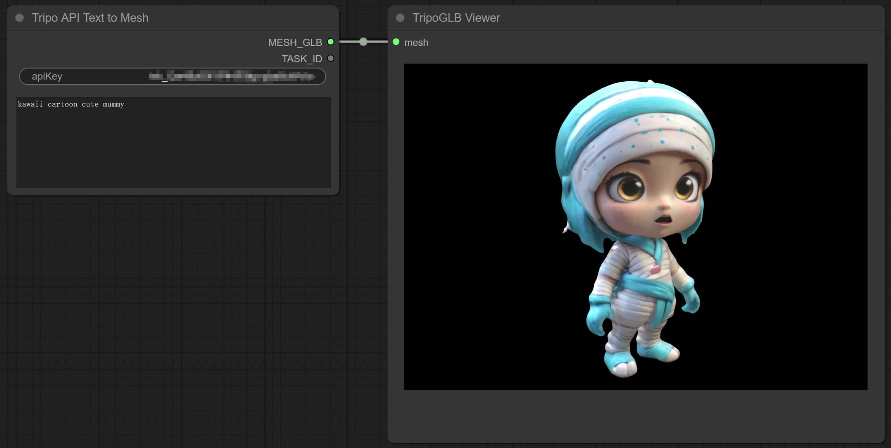
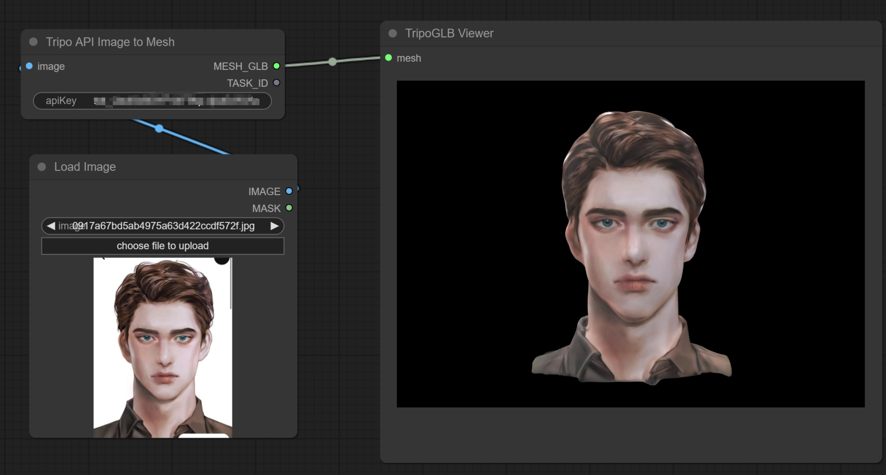

# ComfyUI-Tripo
This extension integrates Tripo into ComfyUI, allowing users to generate 3D models from text prompts or images directly within the ComfyUI interface.

## Features
- Generate 3D models from text prompts using the Tripo API
- Generate 3D models from images using the Tripo API
- View generated 3D models directly in ComfyUI using the TripoGLB Viewer node

## Installation
- Clone or download this repository into your `ComfyUI/custom_nodes/` directory.
- Install the required dependencies by running `pip install -r requirements.txt`.
- (Optional) Set your Tripo API key as an environment variable named `TRIPO_API_KEY` in your env variables.

## Usage
Usually it will take 10~20s to generate a model.

### Tripo API Text to Mesh Node

This node allows you to generate a 3D model from a text prompt using the Tripo API.

- Connect the node to your workflow.
- Enter your text prompt in the "prompt" field.
- The node will output a GLB file containing the generated 3D model.
### Tripo API Image to Mesh Node

This node allows you to generate a 3D model from an input image using the Tripo API.

- Connect an image output to the "image" input of the node.
- The node will output a GLB file containing the generated 3D model.
### TripoGLB Viewer Node
This node allows you to view the generated 3D models directly in ComfyUI.

- Connect the output of either the Text to Mesh or Image to Mesh node to the "mesh" input of the TripoGLB Viewer node.
- The 3D model will be displayed in the node's interface.

## License
This project is licensed under the MIT License. See the LICENSE file for details.

## Credit
Thanks for awesome 3d pack visualization from [ComfyUI-3D-Pack](https://github.com/MrForExample/ComfyUI-3D-Pack)
