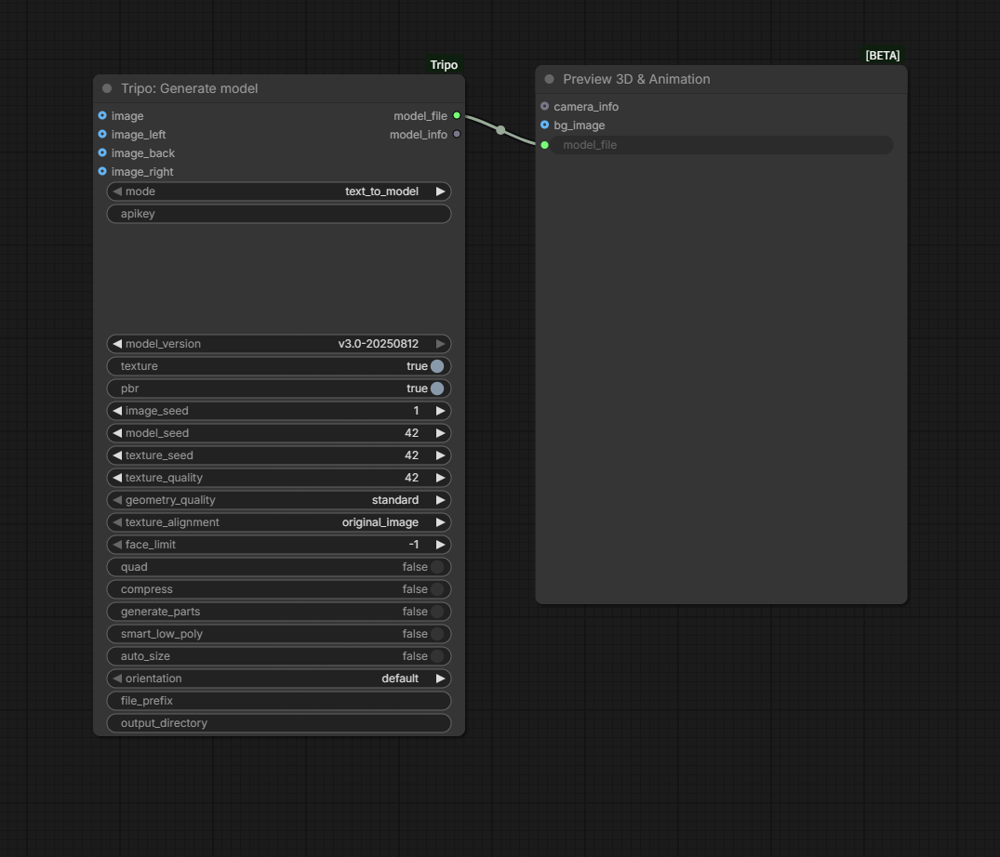
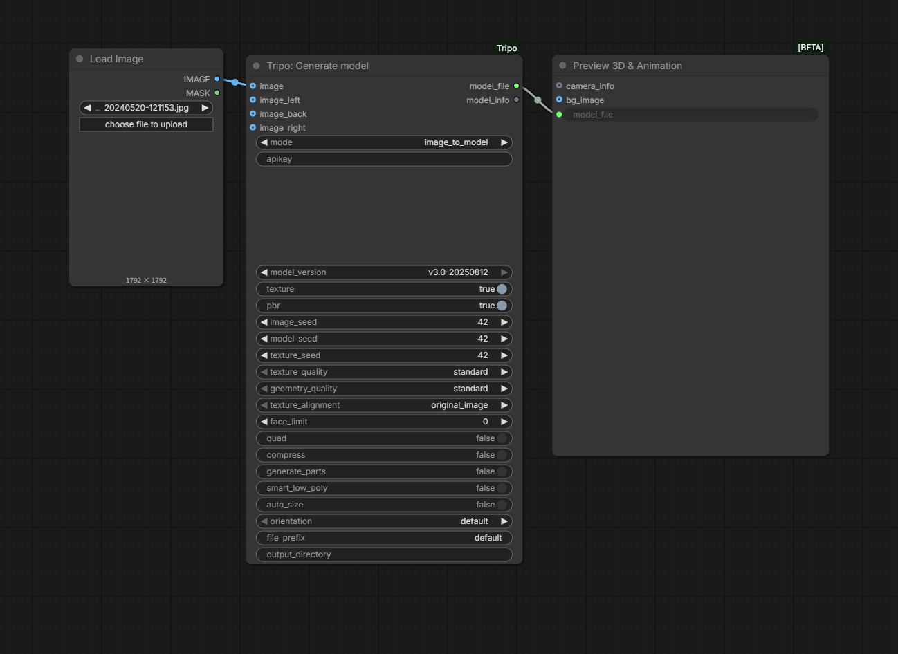

# ComfyUI-Tripo
This extension integrates Tripo into ComfyUI, allowing users to generate 3D models from text prompts or images directly within the ComfyUI interface.

## Features
- Generate 3D models from text prompts using the Tripo API
- Generate 3D models from images using the Tripo API
- View generated 3D models directly in ComfyUI using the TripoGLB Viewer node

## Installation
### [method1] From Source
- Clone or download this repository into your `ComfyUI/custom_nodes/` directory.
- Install the required dependencies by running `pip install -r requirements.txt`.

### [method2] From [ComfyUI-Manager](https://github.com/ltdrdata/ComfyUI-Manager)
If you have ComfyUI-Manager, you can simply search "Tripo for ComfyUI" from `Custom Nodes Manager` and install these custom nodes 

### [method3] From [Comfy Register](https://registry.comfy.org/) using [comfy-cli](https://github.com/Comfy-Org/comfy-cli)
If you have a comfy-cli, you can simply execute `comfy node registry-install comfyui-tripo` in command line.

## Usage
### How to get a key
- Generate an api key from [Tripo](https://platform.tripo3d.ai/)
- Set your key by:
    * [Method1] Set your Tripo API key as an environment variable named `TRIPO_API_KEY` in your env variables. 
        + Windows
            ```
            set TRIPO_API_KEY=tsk_XXXXXXX
            python.exe main.py [--cpu]
            ```
        + Linux/Mac
            ```
            TRIPO_API_KEY=tsk_XXXXXXX python main.py [--cpu]
            ```
    * [Method2] Set your Tripo API key in node input field.
    * [Method3] Set your Tripo API key in `config.json`.

Usually it will take 10~15s to generate a draft model.

### How to use a workflow
Load the png sceenshot in comyfui by dragging or loading manually.

### Workflows
### Text to Mesh


This node allows you to generate a 3D model from a text prompt using the Tripo API.

- Enter your text prompt in the "prompt" field.
- The node will output a GLB file containing the generated 3D model.

### Image to Mesh

This node allows you to generate a 3D model from an input image using the Tripo API.

- Connect an image output to the "image" input of the node.
- The node will output a GLB file containing the generated 3D model.

### Download Model
Models will be automatically downloaded after generation in `ComfyUI\output` folder.

## License
This project is licensed under the MIT License. See the LICENSE file for details.

## Credit
Thanks for awesome 3d pack visualization from [ComfyUI-3D-Pack](https://github.com/MrForExample/ComfyUI-3D-Pack)

Thansk for initial repo from [Tripo-API-ZHO](https://github.com/ZHO-ZHO-ZHO/Tripo-API-ZHO)